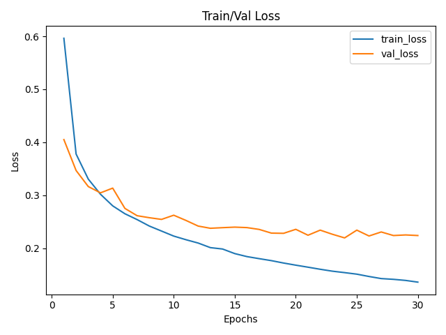
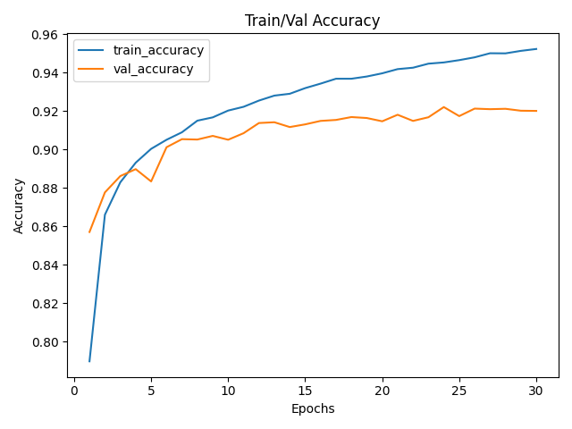
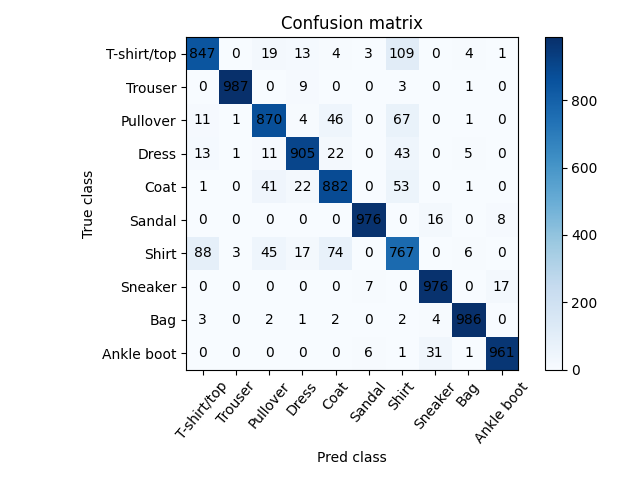

# Fashion-MNIST CNN

一个基于 PyTorch 的 Fashion-MNIST 图像分类项目。

本项目从一个简单的 MLP 基线模型开始，逐步尝试 CNN、不同的下采样策略、数据增强以及增加卷积通道数，并通过验证集、测试集、分类别准确率和混淆矩阵分析模型表现。

## 1. 项目简介

Fashion-MNIST 是一个包含 10 个服装类别的灰度图像分类数据集，每张图片大小为 28×28。

最初使用 MLP 对图片进行分类：

28×28 → Flatten → Linear → ReLU → Linear → 10 classes

由于 MLP 在 Flatten 后会丢失图像原本的空间结构，因此进一步使用 CNN 提取图像中的局部特征，并通过实验比较不同模型结构和训练策略的效果。

## 2. 数据集

使用 PyTorch torchvision.datasets.FashionMNIST。

Training set: 60,000 images

Test set: 10,000 images

Image size: 1×28×28

Number of classes: 10

类别：

| Label	 |   Class    |
|--------|-----------:|
|  0	   | T-shirt/top|
|  1	   | Trouser    |
|  2	   | Pullover   |
|  3	   | Dress      |
|  4	   | Coat       |
|  5	   | Sandal     |
|  6	   | Shirt      |
|  7	   | Sneaker    |
|  8	   | Bag        |
|  9	   | Ankle boot |

训练过程中将训练集划分为：

Training: 50,000
Validation: 10,000

训练集使用 RandomHorizontalFlip 进行数据增强，验证集和测试集不使用随机数据增强。

## 3. 最终模型

最终使用的 CNN：
```python
nn.Sequential(
    nn.Conv2d(1, 32, kernel_size=3, padding=1, stride=1),
    nn.ReLU(),
    nn.MaxPool2d(kernel_size=2, stride=2),
    nn.Conv2d(32, 64, kernel_size=3, padding=1, stride=1),
    nn.ReLU(),
    nn.MaxPool2d(kernel_size=2, stride=2),
    nn.Flatten(),
    nn.Linear(3136, 10)
)
```
数据经过网络时的主要尺寸变化：
```text
Input
1 × 28 × 28
↓ 
Conv2d
32 × 28 × 28
↓ 
MaxPool
32 × 14 × 14
↓ 
Conv2d
64 × 14 × 14
↓ 
MaxPool
64 × 7 × 7
↓ 
Flatten
3136
↓ 
Linear
10
```
其中：
Conv2d：提取局部图像特征
ReLU：提供非线性
MaxPool2d：降低空间分辨率，同时保留较明显的特征
Flatten：将卷积特征转换为一维向量
Linear：根据提取出的特征进行最终分类

## 4. 训练配置

Optimizer: Adam

Learning rate: 0.001

Weight decay: 0.0001

Scheduler: CosineAnnealingLR

T_max: 50

Batch size: 100

Epochs: 30

Loss function: CrossEntropyLoss

Data augmentation:

RandomHorizontalFlip

训练使用 CUDA（如果可用）。

## 5. 实验过程

项目并不是直接确定最终模型，而是通过多次实验逐步调整。

5.1 MLP Baseline

首先使用 MLP 作为基线模型：

Flatten
↓
Linear(784, 128)
↓
ReLU
↓
Linear(128, 10)

MLP 可以完成基本的图像分类，但由于输入图片经过 Flatten 后变成一维向量，原始图像中的空间结构无法直接保留。

此外，实验中发现 T-shirt/top、Pullover、Coat 和 Shirt 等外观相似的类别比较容易发生混淆。

因此尝试使用 CNN。

5.2 CNN

最初的 CNN 使用较大的步幅进行下采样：

Conv → ReLU → Pool
→ Conv → ReLU
→ Flatten → Linear

实验发现过早降低空间分辨率可能损失部分图像信息。

因此后续模型减少了卷积层中的下采样，让卷积层在较大的空间分辨率上提取特征，并主要通过 MaxPooling 进行下采样。

5.3 数据增强

在训练集加入：

transforms.RandomHorizontalFlip()

使模型在训练过程中看到略有不同的输入，从而增加训练数据的变化。

在实验过程中还发现，随机数据增强不应该应用于验证集，因此最终将训练集和验证集使用不同的 transform。

5.4 增加 Feature Maps

将卷积通道数从：

1 → 16 → 32

增加到：

1 → 32 → 64

更多的 feature maps 可以让网络学习更多不同的视觉特征。

实验结果显示，增加模型容量后，验证集表现进一步提高。

5.5 错误分析

除了观察总体准确率，还对测试集进行了分类别分析和混淆矩阵分析。

最终发现 Shirt 是最难分类的类别之一。

其中：

True Shirt → T-shirt/top
True Shirt → Coat
True Shirt → Pullover

是比较常见的错误。

这说明模型的主要错误并不是随机产生的，而是集中在视觉特征相似的服装类别之间。

## 6. 最终结果

最终模型在验证集上的最佳结果：


|    Metric	                  | Result |
|-----------------------------|-------:|
| Best Validation Loss	      | 0.2193 |
| Best Validation Accuracy	  | 92.13% |
| Best Epoch	                |   26   |

测试集结果：

|    Metric	    | Result  |
|---------------|--------:|
| Test Loss	    | 0.2362  |
| Test Accuracy	| 91.57%  |

各类别测试准确率：

|   Class     |  Accuracy |
|-------------|----------:|
| T-shirt/top |   85.0%   |
| Trouser     |   98.5%   |
| Pullover    |   89.1%   |
| Dress       |   92.4%   |
| Coat        |   87.7%   |
| Sandal      |   97.7%   |
| Shirt       |   78.0%   |
| Sneaker     |   97.3%   |
| Bag         |   97.9%   |
| Ankle boot  |   96.5%   |

可以看到，不同类别之间存在明显的性能差异。

Trouser、Bag、Sandal 等类别较容易识别，而 Shirt 的分类准确率明显较低。

## 7. Confusion Matrix

从混淆矩阵可以看到，Shirt 主要被错误预测为：

T-shirt/top
Coat
Pullover
Dress

这些类别之间具有较高的视觉相似性。

## 8. 总结

通过这个项目，我完成了一个从模型建立、训练、验证到测试和错误分析的完整图像分类流程。

在这个过程中，我不仅实现了 CNN，还实践了：

Train / Validation / Test 数据划分
CNN 的卷积、池化和特征提取
Data Augmentation
Adam 优化器
Learning Rate Scheduler
Weight Decay
模型保存与加载
Per-class Accuracy
Confusion Matrix
错误样本分析

最终模型在 Fashion-MNIST 测试集上取得了 91.57% 的准确率。

通过错误分析可以发现，模型的主要困难集中在视觉特征相似的服装类别之间，而不仅仅是模型整体准确率不足。

这个项目也让我对 CNN 的基本工作方式以及完整的机器学习实验流程有了更深入的理解。
